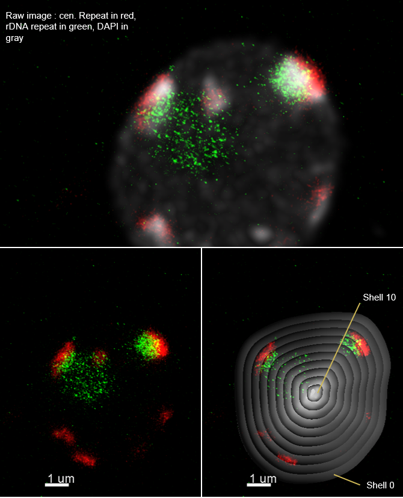
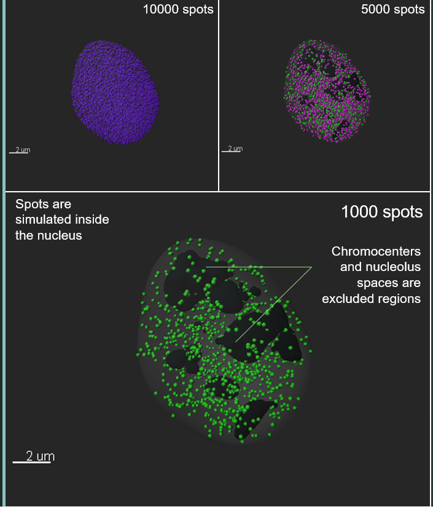

# Imaris plugins for high resolution 3D nucleus microscopy images 

These plugins are designed for isolated nuclei undergone FISH or Immunostaining and conterstained with DNA staining dyes. The 3D microscopy images need to be high resolution for better performance (values in parameter files for each plugin can be adjusted to accomodate different resolution) and you should be able to visualise detect immunostaining foci or FISH spots visually on the images for the segmentation in the plugins to work. 
Please read the FISH_Image processing_protocol.pdf that I published in Methods and Protocols, Methods in Molecular Biology 2018, to get more information about how to acquire such (FISH) images.

## Description of plugins

XTGetShellIntensity.py  | XTSimulateRandomSpots.py
------------- | -------------
Create multiple scaled surfaces of the nucleus surface and export intensity and volume of each shell (area in-between surfaces).  | * Simulate random spots. As an option the user can exclude the chromocenters and the nucleolus from the simulation area.
  | 

## Setting up the  environment
Please follow the visual instructions in the XTFISHInsideNucleus_Manual.pdf to set up and use the plugins, and to have a better understanding on how the segmentation works, so that it is easier to adjust the input parameters for each plugin. This power point was initially created for XTFISHInsideNucleus.py, my first plugin published in http://open.bitplane.com/Default.aspx?tabid=235&id=131. But the same tools and methods has been transfered to other plugins (specially the segmentation method). 

### Prerequisites

<b>Imaris 8.4</b> and higher versions. 

<b>Python 2.7</b> and higher versions and the following packages:
```
Tkinter
os
logging
tkMessageBox
numpy
pandas
tkFileDialog
datetime
shutil 

```

Plugin  | Parameter file  | Import module from this repository
------------- | ------------- | -------------
XTSegmentNuclei.py  | XTSegmentNuclei_Parameters.csv  | None
XTGetShellIntensity.py  | None  | None
XTGetSurfaceVertices.py  | None  | None
XTNucleiPloidy.py  | None  | None
XTSpotIntensity.py  | XTCountSpotPerShell_Parameters.csv  | XTSegmentNuclei.py
XTSimulateRandomSpots.py  | XTSimulateRandomSpots_Parameters.csv  | XTSegmentNuclei.py
XTWholeMountSegmentation.py  | XTWholeMountSegmentation_Parameters.csv  | XTSegmentNuclei.py


## Running the tests and getting started

* You can download a <b>demo file</b> from the following link: 
```
https://www.dropbox.com/sh/7admke13knqzq3e/AADGlJVOT5_IZFcZLYTkfWffa?dl=0

```
Please run the plugins on the demo file provided to make sure that you have all the packages and software versions required to run the plugins properly. 
* Once you have you've confirmed that you get the desired result with the demo files, test few (10 images recommended) of your own images and adjust the parameters untill you get the desired results. 
* Once you have set and saved the input parameters, save all the images you wish to process with the same parameter values under one folder and then run an automated batch processing on that folder. Depending on the number and size of your images this may take a while. When you run any plugin a python console is displayed and keeps track of tasks completed and the duration. This can give you an idea of how much time is required for all your images.

## Built With

* Python 2.7
* Imaris 8.4 and tested on Imaris 9.2

## License

Please feel free to download, use and modify the plugins, during any publication, please attribute to Mariamawit S. Ashenafi. Thank you in advance and good luck.

## Acknowledgments

* UZH images processing plateform for providing Imaris software
* Prof. Reinhard Furrer and Dr. Peter Majer for their recommendations
* Imaris developpers for the well organised and extensive documentation on Imaris' build-in functions.
* Users of Stack Overflow for their questions and usefull solutions.
